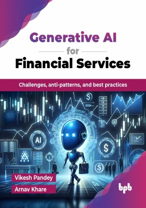

# Generative AI for Financial Services

Challenges, anti-patterns, and best practices.

This is the repository for [Generative AI for Financial Services
](https://bpbonline.com/products/generative-ai-for-financial-services?variant=44264401207496),published by BPB Publications.

## About the Book
Generative AI for Financial Services is a book targeted at any AI practitioner who wants to understand how generative AI works on a fundamental level and extend that learning to risks, challenges, and opportunities in regulated industries like financial services. 

This book explores generative AI and its applications in financial services. It starts by explaining key concepts, differences from traditional AI, and the generative AI lifecycle. Readers learn about foundation models, transfer learning, and implementation strategies, including fine-tuning and training models. Practical use cases like improving customer experiences, automating ESG analysis, and optimizing contact centers are covered. The book also addresses challenges like model bias, ethics, and compliance while focusing on building trustworthy AI with fairness and accountability. Finally, it highlights MLOps and FMOps for efficient AI model deployment and management in production environments.

By the end of this book, you will be well-equipped to navigate the exciting world of generative AI and confidently apply its transformative potential within the financial services landscape.

## What You Will Learn
• Learn about popular use-cases, challenges, risks in financial services, and how to overcome those.

• Learn how to launch and scale generative AI applications in regulated environments like financial services, expanding from tens to thousands of use cases.

• Understand the operational aspects of AI, including MLOps and FMOps.

• Address challenges and ethical considerations in AI implementation.
